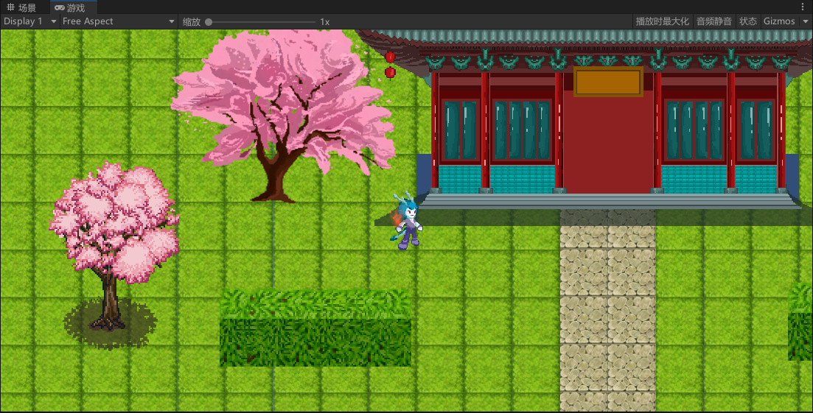
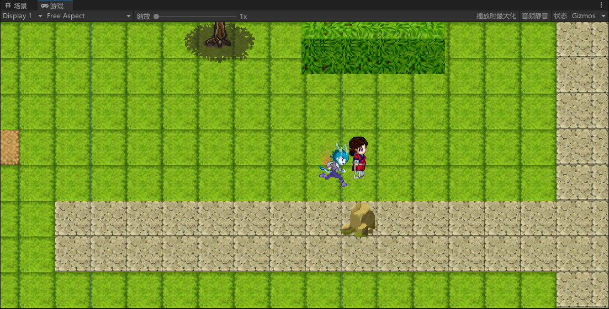
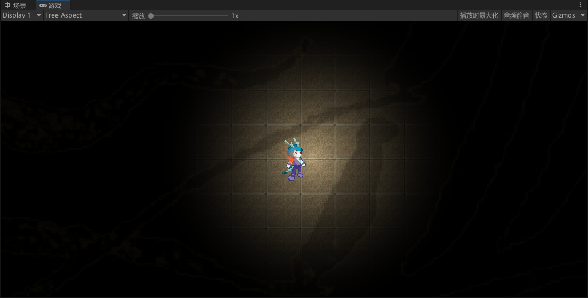
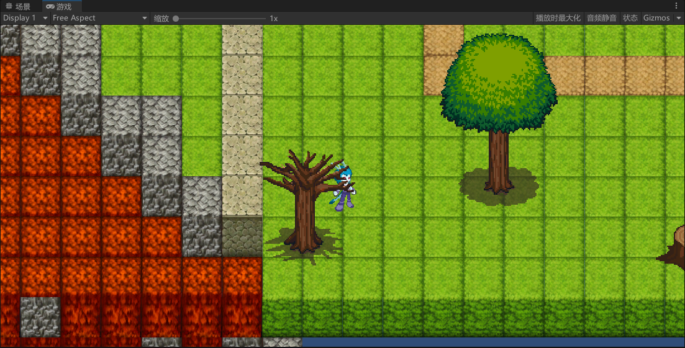

# pixelWindDragonGame

## 像素风的功夫派游戏

​	这是一款古风即时战斗游戏，玩家扮演一位龙人，在一个虚构的冒险世界中探索。游戏的背景设定在一个名为新昌景的城镇地图上，玩家可以与各种NPC进行交互，包括桃花、小溪、雪山和岩浆等地形。此外，游戏还提供多个地牢探索，让玩家可以挑战更多的关卡。在游戏中，玩家需要运用自己的策略和技巧来克服各种难关，不断提升自己的实力和技能，成为真正的冒险家。

## 场景预览

## npc

### 旱魃图

### 冰雪地形

### 岩浆地形

### 小溪

## 操作

wasd

## 下载

### 运行

​	下载代码中的build文件，解压后双击`cangmeng.exe`运行即可

### 退出游戏

​	由于开发进度缓慢，目前没有写退出游戏，可使用`ctrl+alt+delete`呼出任务栏窗口，直接杀后台即可
